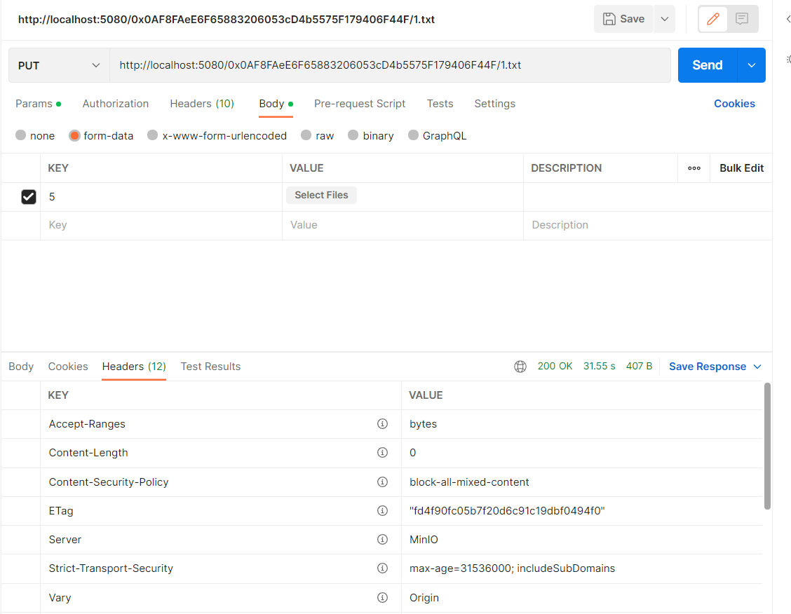
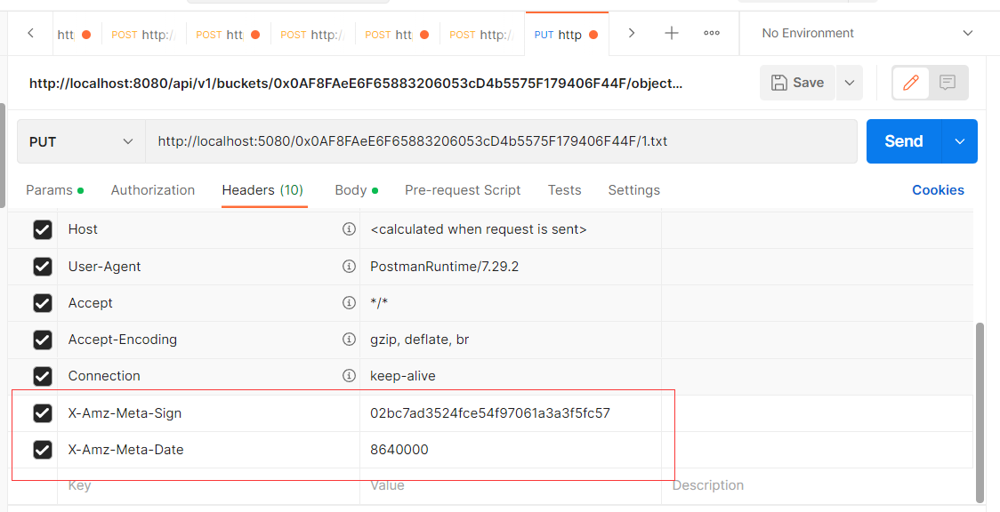
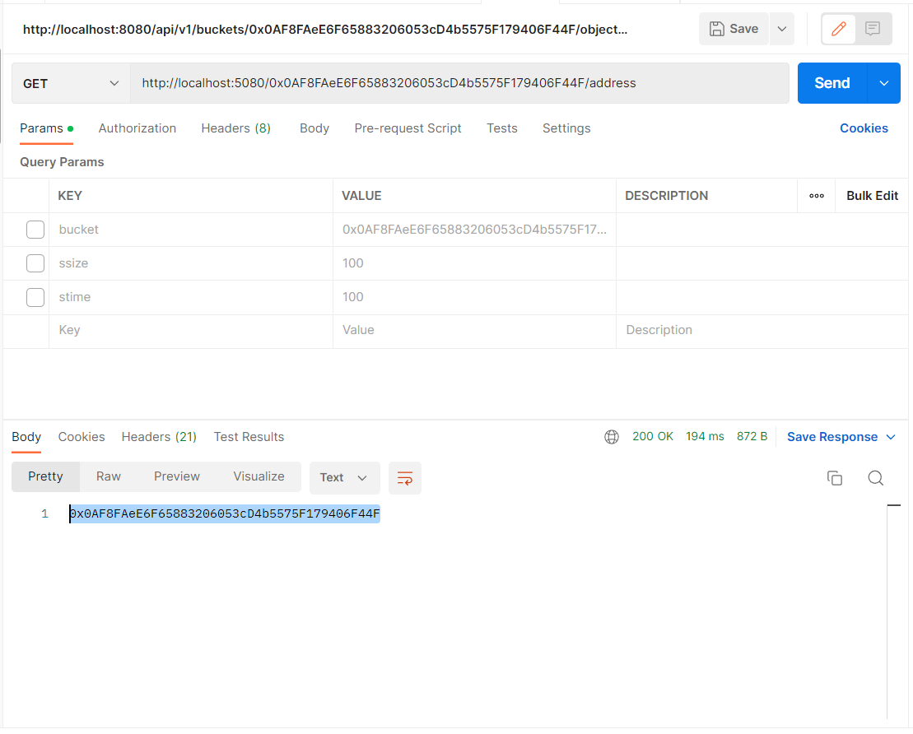
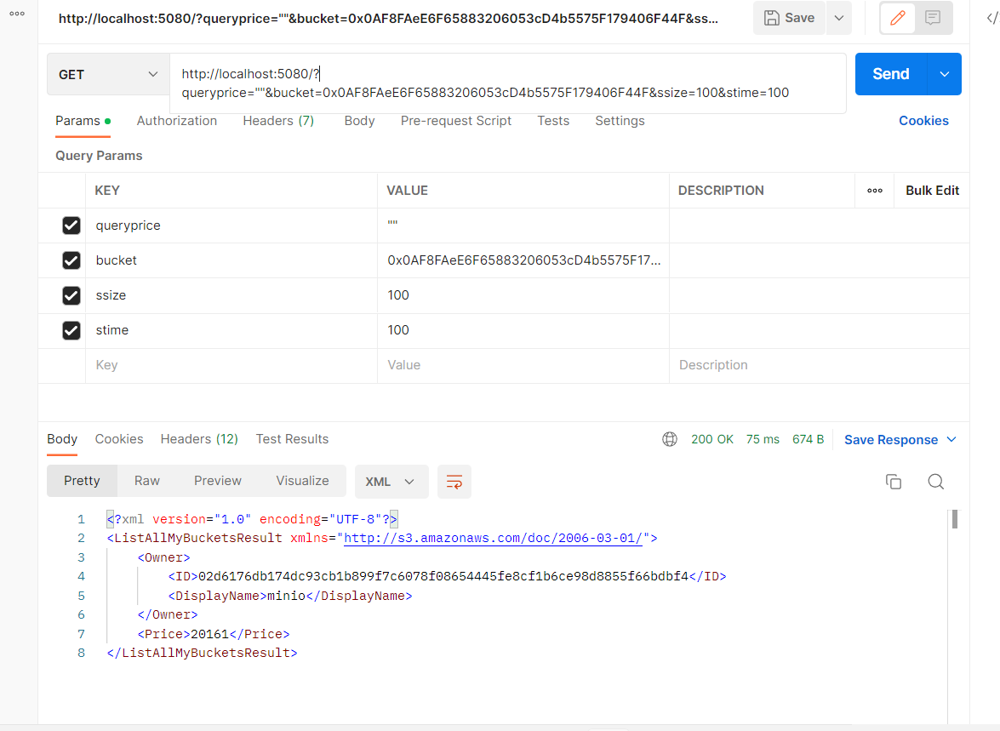
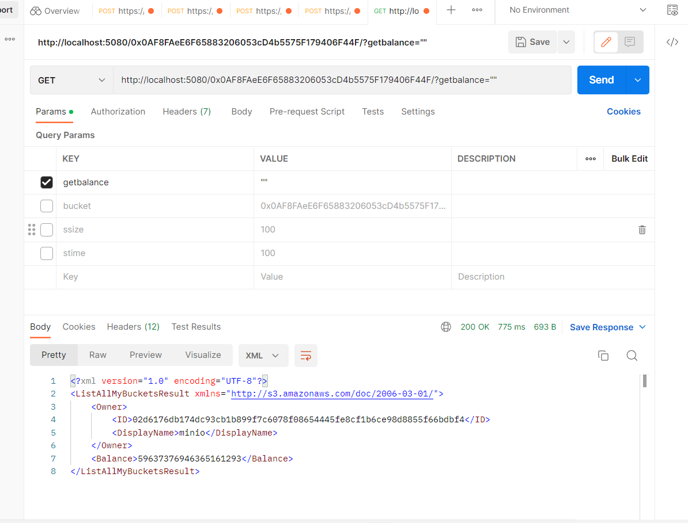
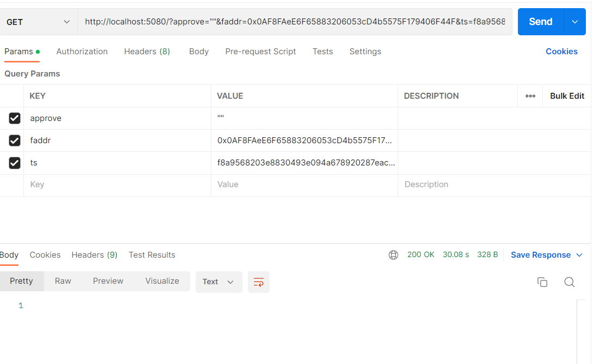
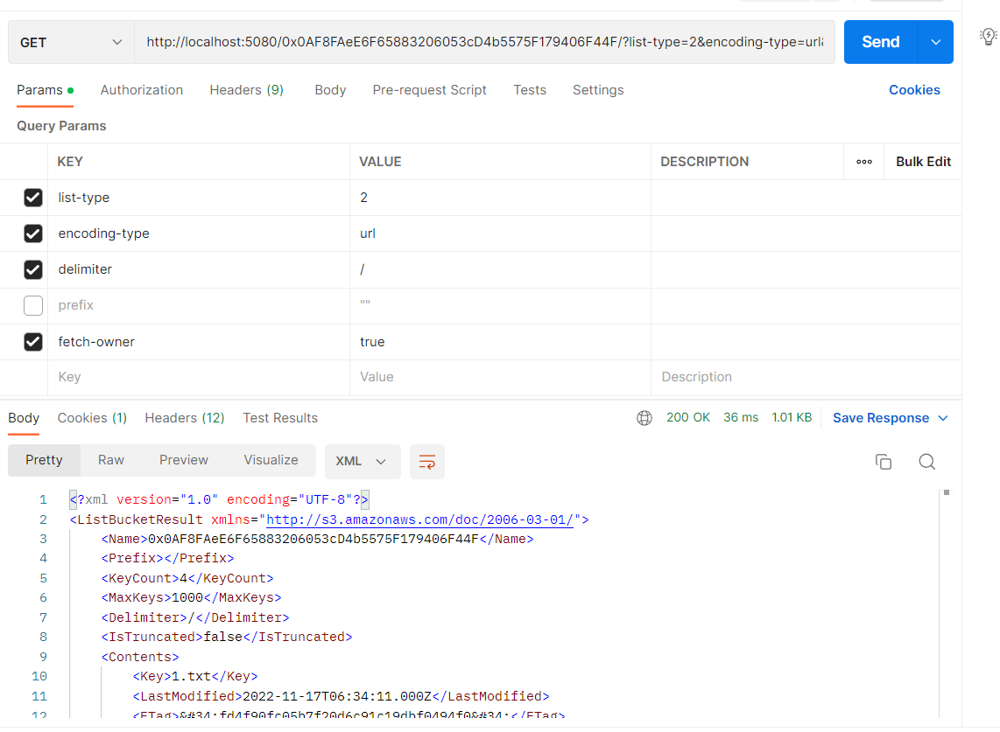

# http-gateway接口

## 上传文件

putobject
method: put
url: http://0.0.0.0:5080/{bucketname}/{objectname}/

x-amz-meta-sign  就是钱包地址对上传文件md5值的签名
x-amz-meta-date 存储时间 单位：秒

return
status 200

## 下载文件

getobject
method: get
url:    http://0.0.0.0:5080/{bucketname}/{objectname}

return
status 200

## 查询价格

QueryPrice
method: get
url:  http://0.0.0.0:5080/?queryprice=""&bucket={bucketname}&ssize={filesize}&stime=(storagetime}

return 
status 200
price

## 查询余额

GetBalanceInfo
method: get
url: http://0.0.0.0:5080/{bucketname}/?getbalance=""

return 
status 200
balance

## Approve

Approve
method: get
url: http://0.0.0.0:5080/?approve=""&ts={$transaction}&faddr={$walletaddress}

faddr： 发送方地址
ts： approve交易hash

return 
status 200

## 列出文件

Listobject
method: get
url: http://0.0.0.0:5080/{bucketname}?list-type=2&encoding-type=url&delimiter=/&fetch-owner=true

