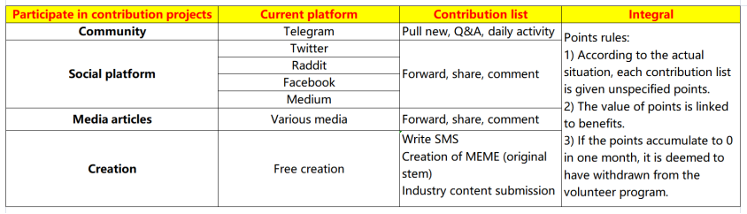

# Recruiting Specific Content

More details about volunteer recruitment will be shown here

&nbsp;

**As a volunteer, you can get:**

* Exclusive priority：Test online priority experience rights at each stage, priority participation right in official offline activities, priority right to know official specific news.

* Gift peripherals：Exclusive benefits for irregular holidays, MEMO exquisite limited peripherals.

* Ambassador selection right：Outstanding people can get the priority selection right of MEMO global ambassador.

* Boost growth：Get more resource support from the MEMO community.

&nbsp;

**Volunteer directions for you to choose:**

**1.Community maintenance**

* Communicate the concept of MEMO project and various community activities to help others to have better understand of MEMO project and its community.

* Maintain MEMO community atmosphere, guide positive discussions, allow the community to discuss rationally, and deal with violators according to the community management system.

* Actively promote various online and offline activities in the community.

**2.Community management**

* Assist the owner of MEMO community and participate in the community management by completing the basic management of the community, etc.

* Invite new users or fans who are interested in the project to join the group, so that more new users can join the community.

* Promote and maintain the brand image of MEMO, and actively cooperate in the activities initiated by MEMO (spontaneous or officials).

**3.Content contributors**

- Delivering the core value of MEMO and the latest progress of the project to more users or potential users through text, pictures, videos, blogs, etc.

- Write the project or industry-related content according to the project from a professional perspective, and submit to the MEMO team.

- Cooperate with MEMO content group to plan content topic selection.

- Assist in document translation or translation of different event Twitter announcements, assist in daily maintenance and interaction with different community members and users globally.

**4.Promote contributors**

- Spontaneously promote MEMO project progress, activities, major events, etc. on various channels or platforms. 

**5.Other**

- Participate in MEMO project product testing, problem feedback, community building, and any other activities that you think will be helpful to MEMO team, but not limited to market research, channel development and etc.

&nbsp; 

**Volunteer contribution reference:**

With the gradual expansion of our community and the needs of project operation, the scope of volunteer contributions will also change. The corresponding points policy will also be updated according to the actual situation. (The following table is for reference).

&nbsp; 

**Apply to become a volunteer:**

How long does it take to apply?

It only takes 2-3 minutes to fill in an online application form, which is very simple and easy to operate.

How to apply for the form?

You only need to click on the link below to complete the application.

>  **​**https://forms.gle/M2mR5J6j95JAeJxc9**​**

&nbsp; 

Memolabs Volunteer Group —— Join US

>  Telegram： [https://t.me/MemolabsVol](https://t.me/MemolabsVol) ​

&nbsp;

**We look forward for you to join in and work together with MEMO team, to create the vision of** **keeping** **human data forever!**

​
