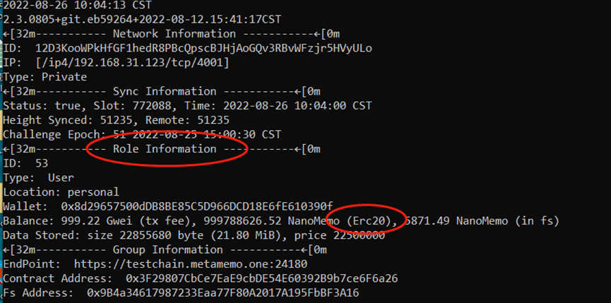
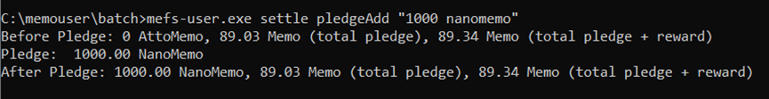
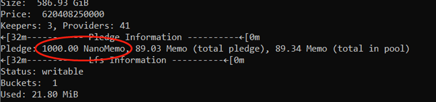
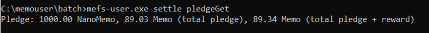
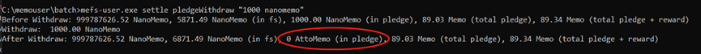

# How to Pledge MEMO

Documentation on the use of the pledge function (example for the user, same for other nodes)

&nbsp; 

## Note

The following commands are executed only if the MEFS_PATH environment variable has been set to the root directory of the node, using the user as an example:

In the linux environment, the default root directory of the node is ~/.memo-user, set the root directory with the command below

```shell
MEFS_PATH=~/.memo-user
```

In the windows environment, the default root directory of the node is c:\memouser, set the root directory with the command below

```shell
set MEFS_PATH=c:\memouser
```

MEMO unit conversions：

```shell
1 Memo= 10^9 NanoMemo = 10^18 AttoMemo
```

## Pledge operation

First check the node info panel to confirm that the current ERC20 balance is sufficient for pledging.



When you have confirmed that the ERC20 balance is sufficient, you can proceed with the pledge operation.

Pledge 1000 NanoMemo to the pledge pool:

```shell
mefs-user settle pledgeAdd "1000 NanoMemo"
```



After run the command, you can see that the pledge amount has increased by 1000 NanoMemo.

 

## Check the current pledge amount

```shell
mefs-user settle pledgeGet
```

 

## Extracts MEMO from the pledge pool to the FS pool

```shell
mefs-user settle pledgeWithdraw "1000 NanoMemo"
```

 

## Move memo from Fs file system to wallet

```shell
mefs-user settle withdraw "1000 NanoMemo"
```
