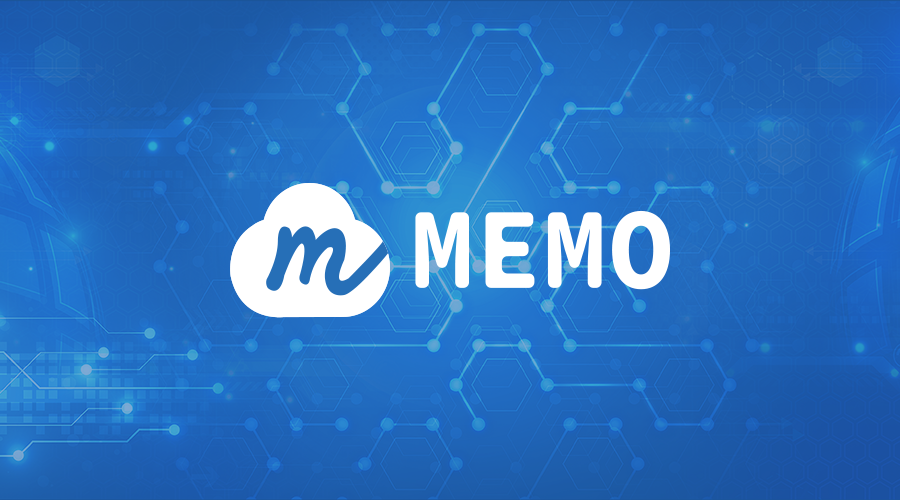

# Introduction

&nbsp;

Memo is a large-scale decentralized data storage system with high security and reliability built around blockchain. It is a new-gen blockchain decentralized cloud storage protocol that organizes global edge storage nodes to provide users with safe, reliable and highly available storage services.

&nbsp;
MEFS(MEmo File System) is the file storage system for MEMO.

&nbsp;

MEMO is a new-gen blockchain decentralized cloud storage protocol developed by MEMO Labs. Our mission is to build a reliable infrastructure for Web3.0. To achieve high scalability and availability, MEMO has vastly innovated data tiering, verification, fault tolerance, and recovery mechanisms. MEMO has made technological breakthroughs on blockchain cloud storage with a new architecture and multiple innovations.

&nbsp;

MEMO has designed three user roles: the User, the storage space user; the Provider, the storage space provider; and the Keeper, the coordination manager. Driven by smart contracts, three interconnected roles constrain each other.

&nbsp;

MEMO can be divided into three functional role-based layers: settlement, verification, and storage. The settlement layer processes settlement on-chain by aggregating order information and sending the amount of each order to the storage nodes Provider. The verification layer is conducted off-chain. The Keeper nodes challenge the Provider nodes, verifie the results of the proof, and decide whether to issue the withdrawal certificate to the Provider nodes. All processes on the verification layer will go through nodes on the same layer and pass the Byzantine fault-tolerant consensus. The storage layer consists of massive scattered Provider nodes, which store genuine User data and regularly submit the proof of storage to the verification layer.

&nbsp;

The following articles will help you learn more.

What is MEMO?

[Memoriae — Next Generation of Decentralized Cloud Storage Based on Blockchain](https://memolabs.medium.com/memoriae-next-generation-of-decentralized-cloud-storage-based-on-blockchain-9151ab8c1aaa)

Roles：

[Build an Autonomous Storage System: Role Design in Memoriae](https://memolabs.medium.com/build-an-autonomous-storage-system-role-design-in-memoriae-f724c405ddc)

[Memoriae System Node Matching](https://memolabs.medium.com/memoriae-system-node-matching-d246fca41009)

Technology：

[Multilevel Fault-tolerant Mechanism Design for MEMO Decentralized Cloud Storage System](https://memolabs.medium.com/multilevel-fault-tolerant-mechanism-design-for-memo-decentralized-cloud-storage-system-f3c585eb401d)

[MEMO Original Data Recovery Strategy: Risk-Aware Failure Identification (RAFI)](https://medium.com/memolabs/the-risk-aware-failure-identification-rafi-strategy-of-memo-decentralized-cloud-storage-system-6c5990ec8cb3)

&nbsp;  

## Sign up for Auth Token

The user clicks on the link to obtain test tokens in the Memoriae wallet (under development), and the system will send the user a test token of 10 Memo. When the user's test balance is not less than 10 Memo, they will not be able to apply for the test token again.

send an eail to [sup@memolabs.org](mailto:sup@memolabs.org) to apply for test tokens

Email subject: apply for test token

Email content: account address (format such as 0x...), role (Provider or Keeper or User)

&nbsp; 

## Interactive Forum

Persons who are interested in decentralized data storage systems are welcome to join the Memo community and participate in interaction!

Our [GITHUB](https://github.com/memoio/testnet/issues) URL is:

https://github.com/memoio/testnet/issues

Our [TWITTER URL](https://twitter.com/Memo_Labs) is:

https://twitter.com/Memo_Labs