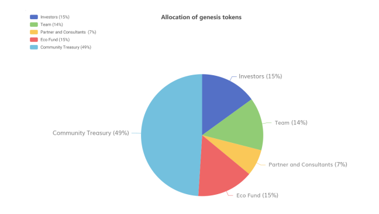

# MEMO TOKEN ECONOMICS

## 1. Introduction to MEMO Protocol

MEMO is a new-gen blockchain decentralized cloud storage protocol developed by MEMO Labs. Our mission is to build a reliable infrastructure for Web3.0. To achieve high scalability and availability, MEMO has vastly innovated data tiering, verification, fault tolerance, and recovery mechanisms. MEMO has made technological breakthroughs on blockchain cloud storage with a new architecture and multiple innovations.

MEMO has designed three user roles: the User, the storage space user; the Provider, the storage space provider; and the Keeper, the coordination manager. Driven by smart contracts, three interconnected roles constrain each other.

MEMO can be divided into three functional role-based layers: settlement, verification, and storage. The settlement layer processes settlement on-chain by aggregating order information and sending the amount of each order to the storage nodes Provider. The verification layer is conducted off-chain. The Keeper nodes challenge the Provider nodes, verifie the results of the proof, and decide whether to issue the withdrawal certificate to the Provider nodes. All processes on the verification layer will go through nodes on the same layer and pass the Byzantine fault-tolerant consensus. The storage layer consists of massive scattered Provider nodes, which store genuine User data and regularly submit the proof of storage to the verification layer.

## 2. TOKEN Design

### 2.1Definition

MEMO is a MEMO-protocol token to drive operation and scale up the entire MEMO storage protocol. In this protocol, to earn income, the Keeper and the Provider will need to make pledges to MEMO, while the User uses MEMO tokens to pay for data storage and retrieval. MEMO will increase the issuance of tokens to incentivize the Keeper, the Provider, and long-term token holders based on their order volume. MEMO is not merely a token in use, but also equity. This enables MEMO token holders to benefit from a growing MEMO ecosystem by participating in our governance.

### 2.2 Principles

Technically speaking, MEMO aims to create a large-scale data storage pool, ensuring data security, reliability, and privacy through our public verification mechanisms, encryption algorithms, multi-level fault tolerance, and recovery mechanisms while effectively reducing on-chain load and enhancing scaling performance through our tiered storage.

On our TOKEN design, MEMO intends to create value for our users and participants in the ecosystems, improve productivity, and incentivize ecological growth. The principle of our economic model is the fairest possible participant incentive in proportion to their costs. The logic of the economic model should be governed by codes to eliminate human control. The economic model should incentivize participant behaviors beneficial to the protocols.

## 3. Circulation Mechanism

### 3.1 MEMO Economic Circulation

TOKEN will be circulated among the User, the Keeper, the storage nodes Provider, as well as developers, investors, and token holders. First of all, the User needs to purchase MEMO tokens to pay for storage service, the Keeper and the Provider need to purchase MEMO tokens as pledges before providing their service and earning incomes. MEMO tokens paid by the User for storage service will be sent to the Keeper and the Provider. Meantime, the Keeper, the Provider, and long-term holders will be given incentive awards for ecological growth by pledging MEMO tokens in the pledge pool. So the production and circulation of MEMO token is a cycle of consumption and reproduction, as storage gradually scales and token value appreciates.

### 3.2 MEMO Use Scenarios

There are two use scenarios of MEMO token (MetaMEMO) in the MEMO protocol: as a pledge and as payment for storage service. Pledges are often associated with the Keeper and the Provider, while payments are concerned with the User and developers.

Pledge: For better user experience, a pledge of a number of MEMO tokens is required to become the Keeper and the Provider. The purpose is to restrict and regulate behaviors of the Keeper and the Provider and advocate honest and reliable services.

Payment: The User, the end consumer or developers, use TOKEN to pay for data storage, retrieval, and download service. The TOKEN will eventually go to the Provider and the Keeper as the income for providing data storage and management services. So the User and developers need to purchase MEMO TOKEN before using the storage service and transfer it to the order pool before signing an order to use MEMO storage service.

MEMO token also represents the rights and interests of the entire protocol. Therefore, MEMO token holders can pledge MEMO tokens to the pledge pool to obtain additional incentive earnings. Meantime, MEMO token holders will be able to participate in the governance of the protocol with future governance mechanisms.

## 4. Token Distribution

### 4.1TOKENOMICS

The initial token supply of MEMO is capped at 600,000,000 on current inflation. It is expected that it will be prudent for the protocol to incorporate modest inflation after time to incentivize vibrant participants based on the community.

These various token allocations are locked to ensure our investors that we have the best intention and maintain a long-term vision for the project. These Tokens are secured via smart contract and will be paid out to the MEMO team, investors, partners, and consultants, a community so they can decide to use them for purposes such as grants to developers and contributors, adjustments to protocol distribution, and Eco Fund for research and development in the MEMO ecosystem with Liquidity and Staking allocation for exchange liquidity and staking rewards. This helps to keep their interests aligned.

### 4.2 Initial Token Issuance Mechanism

The share and release period for the initial distribution is as follows:

**Investors(15%)**: 15% of Tokens are allocated to investors in 3 parts.
**Part 1**:  5% in total are for seed round investors of which 10% will be released before listing with a 6 months cliff and 18 months linear release schedule. 
**Part 2**:  9 % in total are for private investors of which 15% will be released before listing with a 6 months cliff and 18 months linear release schedule. 
**Part 3**:  The remaining 1% for public investors.

**Team (14%)**: There is also a 14% allocation for the team with a 5-year release schedule vested via smart contracts.

**Partners and consultants (7%)**: Partners and consultants are also allocated 7% with a 5-year release schedule vested via smart contracts.

**Eco fund (15%)**: Eco fund accounts for 15% with a 5-year unlock schedule which is vested via smart contract.

**Community treasury (49%)**: 49% is allocated to the community’s treasury, which the community can decide to use for purposes such as grants to developers and contributors, adjustments to protocol distribution mechanics, etc, the token will be unlocked within 20 years.

The initial allocations of the total supply are represented below by chart.

 

## 5. Ecological Development

### 5.1 Foundation

MEMO Foundation is mainly for ecosystem development, marketing, and community maintenance. Meantime, partial funding is invested to promote ecological development and maintain the foundation’s long-term sustainable operation.

MEMO Foundation assumes the following responsibilities:

● Organize the development team or outsource tasks to implement the MEMO protocol and its updates.

● Support and fund MEMO ecological applications.

● Persistently contribute to long-term MEMO community operations.

MEMO Foundation has the right to initiate proposals concerning system governance. The community has the decision on its final implementation.

The Foundation may initiate the following proposals, including but not limited to:

● Modify the systems’ economic parameters.

●Propose technical updates.

● Penalize the Keeper’s wrongdoing or inaction.

● Penalize the Provider’s wrongdoing or inaction. 

### 5.2 Community Ecology

As a blockchain-based decentralized storage solution, the development of MEMO protocol is inseparable from community support. MEMO Foundation will actively organize and build various communities with different functions including ecology governance, developer community, and token holder community to encourage the healthy and stable development of protocol and ecology on many fronts. 

### 5.3 The Keeper

Before joining our protocol, the Keeper must pledge sufficient deposits.

The Keeper must fulfill the following obligations:

● Pledges shall not be less than the specified amount of deposit.

● Ensure long-term online activities and maintain historical data on the verification layer.

● Verify the Provider's Proof of Storage and issue a withdrawal certificate to the Provider through the Byzantine fault-tolerant consensus.

● Schedule a data recovery process when the Provider loses data.

Meantime, the Keeper is entitled to the following benefits:

● Earn a certain percentage from orders under its management.

● Obtain incentive reward from the pledged deposits.

Penalty may apply for any wrongdoing or inaction, such as deductions from the deposits and no further earnings from service provisions. 

### 5.4 The Provider

Before joining our protocol and receiving earnings from orders signed with the User, the Provider must pledge sufficient deposits.

The Provider must fulfill the following obligations:

● Pledges shall not be less than the specified amount of deposit.

● Ensure data is stored in accordance with the standards specified in the order, and the reliability and availability of the data.

● Timely submit the Proof of Storage to the verification layer.

Meantime, the Provider is entitled to the following benefits:

● Gather payment progressively from user's orders.

● Obtain incentive reward from the pledged deposits.

Any failure to fulfill obligations (e.g. data loss or overdue proof submission) may result in penalties, including deductions from the deposits and order transfers. 

### 5.5 The User

User is the consumer of the protocol and needs to pay for the storage service. As a User, you need to fulfill the following obligations:

● Deposit enough Tokens into the contract to pay the storage fee. Meanwhile, the User has the following rights:

● Choose suitable Provider and Keeper to serve yourself;

● Rate the services of Provider and Keeper;

● Obtain incentive income from the staking pool. 

### 5.**6** Developers

Developers can adopt MEMO protocol in their projects. More projects using MEMO storage service will bring more users and storage demands.

MEMO Foundation will screen valuable contributors towards MEMO protocol through developer events and incentivize developers with tokens to incubate their projects. Developers must fulfill the following obligations:

● Maintain their projects.

● Keep up-to-date with the latest Memo protocol.