# For Linux

Before starting the memo, you must install docker.

&nbsp; 

**Docker:** [Install on Linux](https://docs.docker.com/desktop/install/linux-install/)

**How to install Docker in Linux(Ubuntu)：**

**1、Update apt package index**

```shell
sudo apt-get update
```

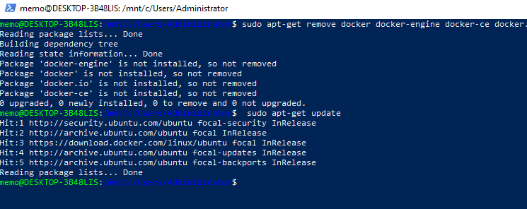


&nbsp;

**2、Install the following packages to enable apt to use the repository over HTTPS**

```shell
sudo apt-get install -y apt-transport-https ca-certificates curl software-properties-common
```

​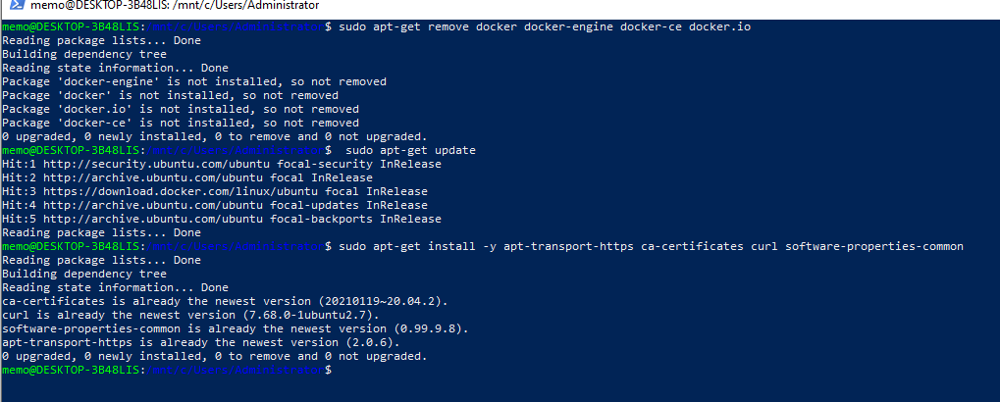

​&nbsp;

**3、Add the GPG key of Docker official**

```shell
curl -fsSL https://download.docker.com/linux/ubuntu/gpg | sudo apt-key add
```

**4、Run the following command line to set up the stable repository**

```shell
sudo add-apt-repository "deb [arch=amd64] https://download.docker.com/linux/ubuntu $(lsb_release -cs) stable"
```

​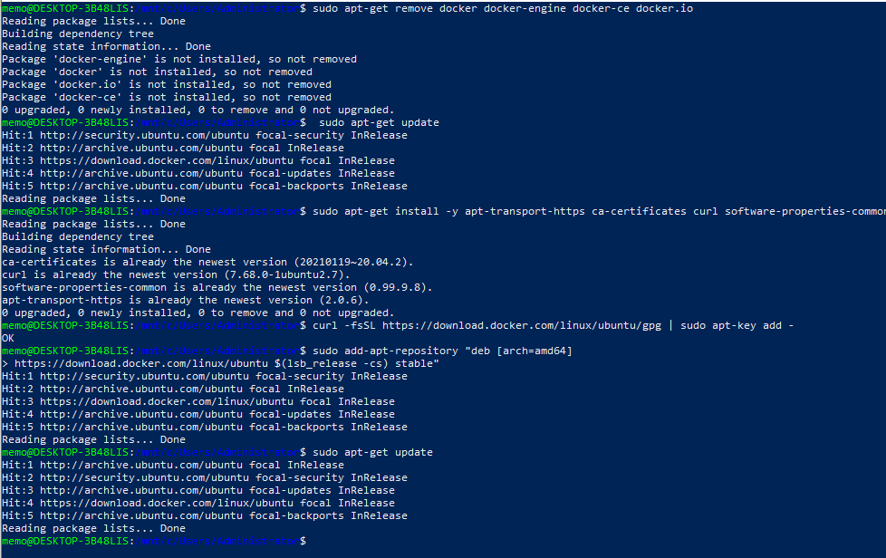

​&nbsp;

**5、 Update the apt package index again**

```shell
sudo apt-get update
```

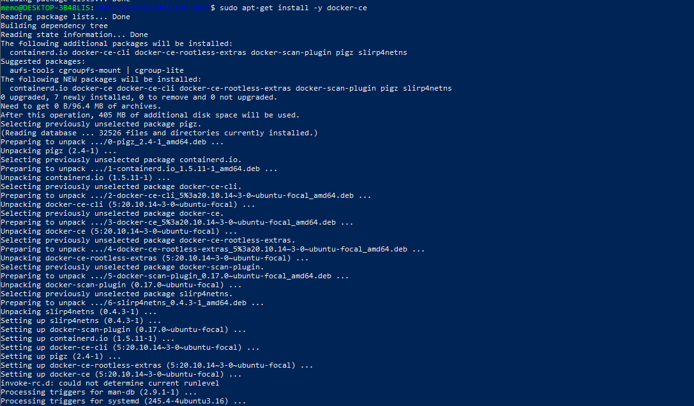

&nbsp; 

**6、 Install the latest version of Docker CE**

```shell
sudo apt-get install -y docker-ce
```


&nbsp; 

**7、 Verify whether the installation is successful**

Check the version of docker installed

```shell
docker -v
```

Start docker and pull hello-world to verify whether the installation is successful

```shell
sudo service docker start
```

Since sudo access is required to use docker, enter the password here and it will be started successfully.

Next, run the following command line

```shell
sudo docker run hello-world
```

You can see the container being downloaded from the remote for testing： Pulling from library/hello-world

When you see the message： Hello from Docker! It means the docker is successfully installed.

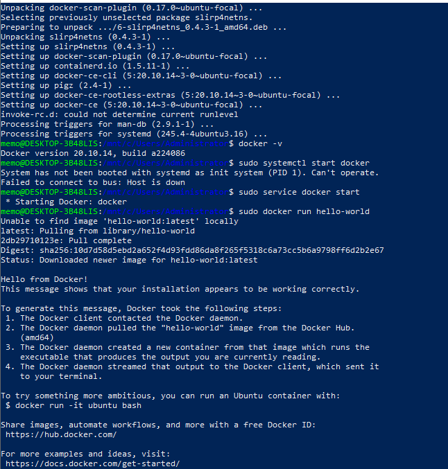

# For Windows

Before starting the memo, you must install docker.

&nbsp; 

**Windows install Docker：**

1、[Docker official website](https://www.docker.com/)

2、Download docker for windows

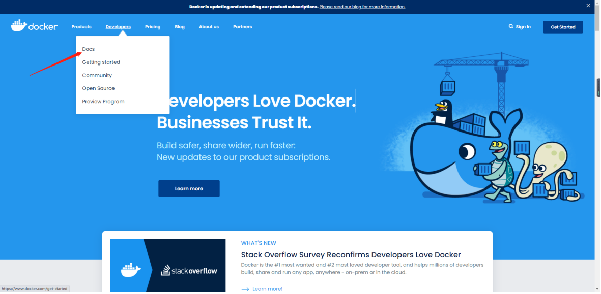

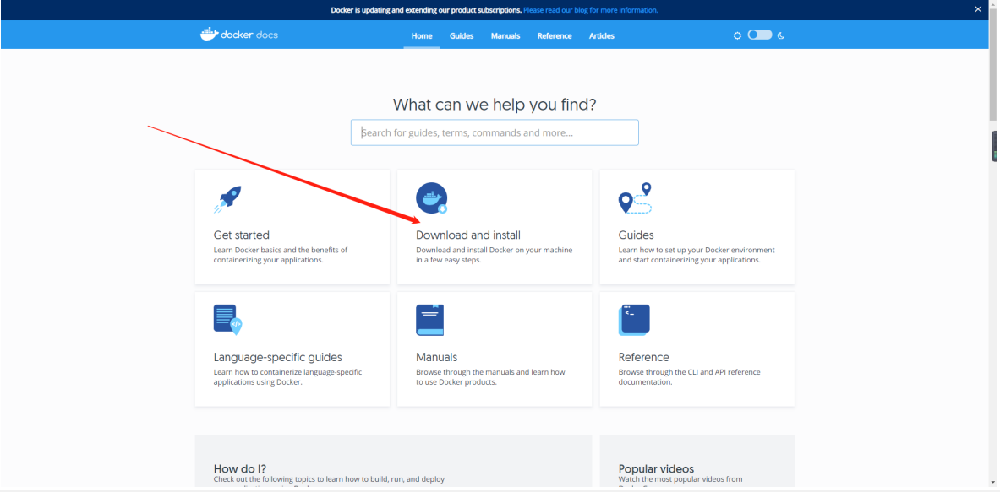

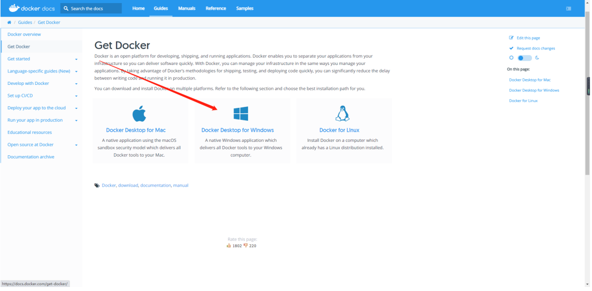

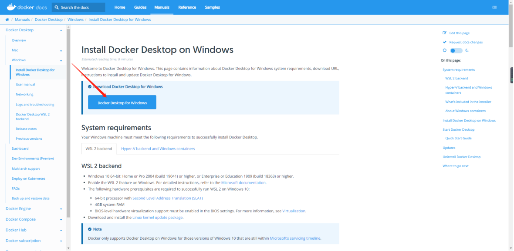

&nbsp; 

Wait for the download to complete.

&nbsp; 

Double click to install.

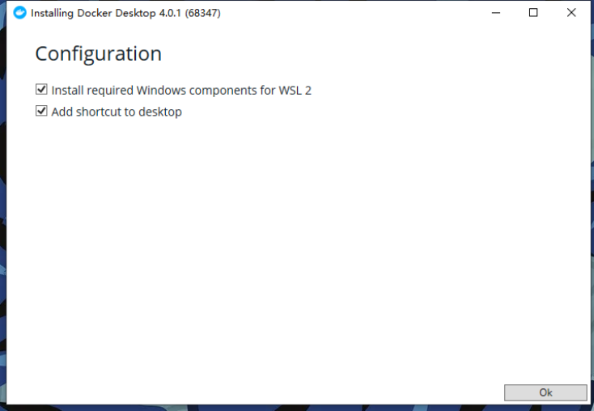

&nbsp; 

Wait, finish.

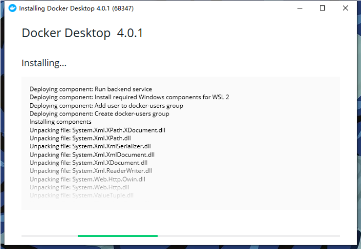

&nbsp; 

After the installation is complete, you will be prompted to restart the computer.

 &nbsp;

Double-click the icon to start docker.
