# Step by step

Using user node as an example, providers are the same. 

## Note

For user nodes, if there is important data stored in memo, please download it to the local hard disk first, otherwise the data will be lost.

## Step1(For existing nodes)

1.Enter the node

```shell
docker exec -it mefs-user bash
```

​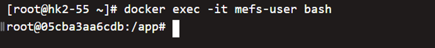

2.Export the node sk and wallet address and save it

```shell
mefs-user wallet default
```

​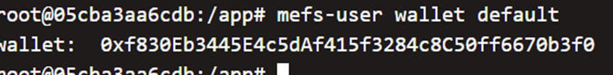

```shell
mefs-user wallet export 0xf830Eb3445E4c5dAf415f3284c8C50ff6670b3f0
```

​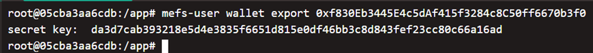

3.stop the node and delete the node root directory, the default is .memo-user

​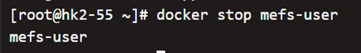

## Step2(For new nodes)

1.Send the wallet address to us for topping up

2.Download the latest version of image

```shell
docker pull memoio/mefs-user:latest
```

​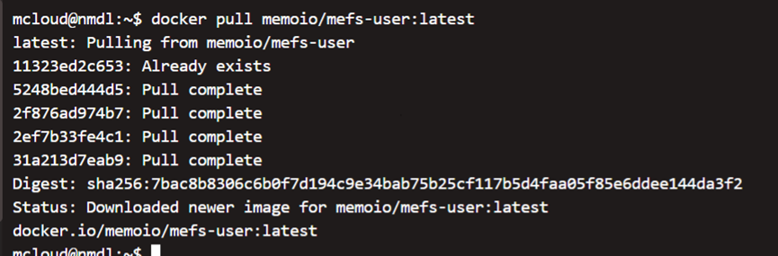

Set up the environments for root directory and data directory

```shell
MEFS_PATH=~/memo_user

MEFS_DATA=~/memo_user_data
```


3.Regenerate the node root directory using sk

```shell
docker run --rm -v $MEFS_PATH:/root --entrypoint mefs-user memoio/mefs-user:latest init --sk= da3d7cab393218e5d4e3835f6651d815e0df46bb3c8d843fef23cc80c66a16ad --password=memoriae
```

​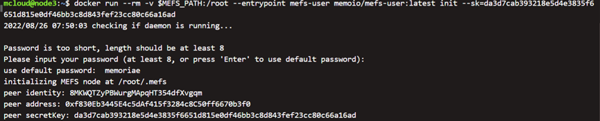

4.Update the configuration file

version:

```shell
docker run --rm -v $MEFS_PATH:/root --entrypoint mefs-user memoio/mefs-user:latest config set --key=contract.version --value=2
```

​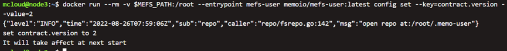

endpoint:

```shell
docker run --rm -v $MEFS_PATH:/root --entrypoint mefs-user memoio/mefs-user:latest config set --key=contract.endPoint --value="https:// testchain.metamemo.one:24180"
```

​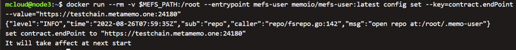

contract:

```shell
docker run --rm -v $MEFS_PATH:/root --entrypoint mefs-user memoio/mefs-user:latest config set --key=contract.roleContract --value=" 0x7c797a5d4809e3FA59d4988b6EeB8880D83Eef3a"
```

​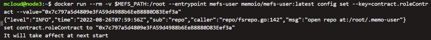

bootstrap:

```shell
docker run --rm -v $MEFS_PATH:/root --entrypoint mefs-user memoio/mefs-user:latest bootstrap clear
```

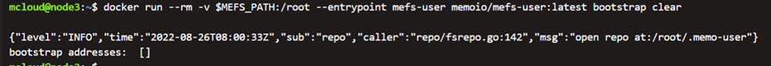

```shell
docker run --rm -v $MEFS_PATH:/root --entrypoint mefs-user memoio/mefs-user:latest bootstrap add

"/ip4/1.182.90.4/tcp/14071/p2p/12D3KooWRJ4Hs5oKEonaz2B5j2DVFTa4j66oHfzndVLCmYhkWY2w"
```

5.Start the node

```shell
docker run -d --stop-timeout 30 -v $MEFS_PATH:/root -v $MEFS_DATA:/root/data -e PRICE=250000 -e PASSWORD="memoriae" -e GROUP=2 -e SWARM_PORT=4001 -e DATA_PATH=/root/data --name mefs-user memoio/mefs-user:latest
```

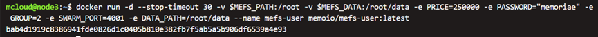

6.Wait for the synchronization til the status turns true

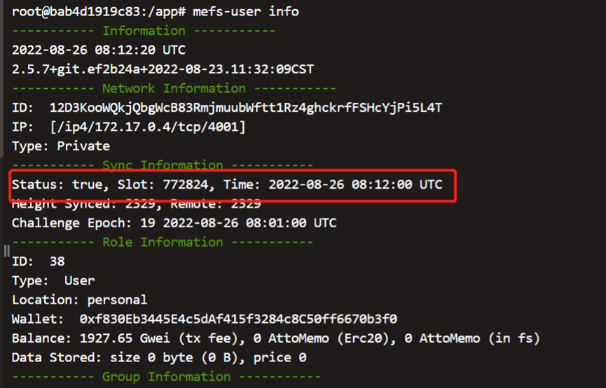

## Step 3: (For providers only)

1.declare

When participating as a provider node, you need to run the declare command (declare the public address), which is used to communicate between nodes.

Prepare your public ip + port, the demonstration is as below.

```shell
mefs-provider net declare /ip4/x.x.x.x/tcp/4001
```

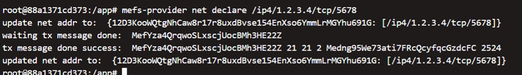

Explanation of parameters.

suppose 1.2.3.4 is your public ip

4001 is your public port, which corresponds to the port 4001 mapped when the node is started.
